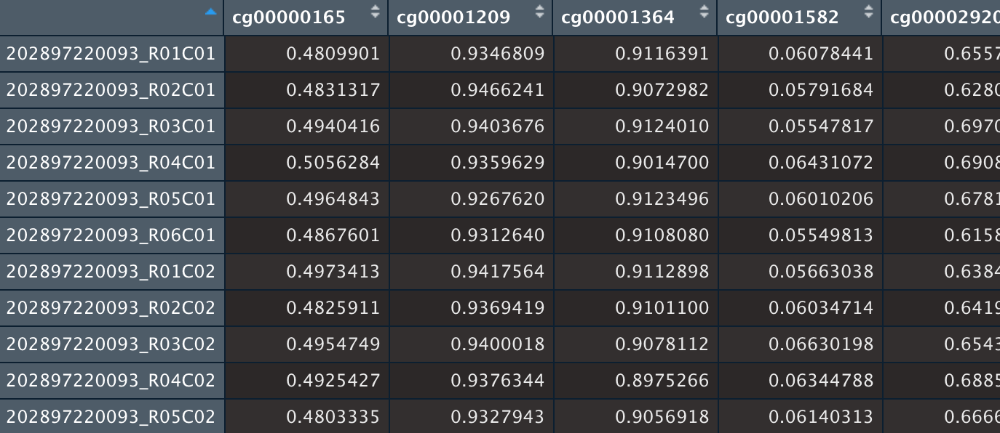

## Landing Page

## Introduction

We have developed Lifespan, gestation time, sexual maturity time, tissue, species etc. predictors built for Mammalian DNA methylation data. The models were trained on an unprecedented DNA methylation data set by Mammalian Methylation Consortium across 348 mammals generated using a custom DNA methylation measurement platform (A. Arneson et al., 2022).

---

## Predictor Table of Contents

| Predictor | Location | Note |
|:-----------|:-----------|:------------|
| Tissue | [./Predictors/Tissue_Overlap320K40K_Filter5samples__100trees_RF.RDS](./Predictors) | 100 Trees, feature class balancing\* |
| Species | [./Predictors/Species_Overlap320K40K_Filter5samples_100trees_RF.RDS](./Predictors) | 100 Trees, feature class balancing\* |

\**To counter the unbalanced classes (much more samples in certain tissues), we capped the random forest’s sample bootstrapping step to no more than 100 samples per class(species/tissue).*

---

## Tutorial

### Insatall Necessary Packages

To install packages, please use R base package installation function `install.packages(PACKAGE_NAME)` to source and install CRAN-hosted packages.

---

Necessary packages, [randomForest](https://www.rdocumentation.org/packages/randomForest/versions/4.7-1.1/topics/randomForest), [glmnet](https://glmnet.stanford.edu/articles/glmnet.html).

```{r}

# Install devtools in R

install.packages("randomForest")
install.packages("glmnet")

```

---

### Use the package directly (very simple)

Simply load the normalized data, by SeSAme pipeline (see Arneson, 2021, and shorvath/MammalianMethylationConsortium). Then user the function in the package.

```{r}

dat0 <- readRDS("PATH_TO_YOUR_DATA")

# fit the predictor
results = predictLifespan(dt = dat0, arrayType = "40K")

```

---

### OR, you can write your own code and use the predictors saved in this repository

Set correct working directory

```{r}
# If your working directory is not already this downloaded repo's directory
setwd("YOUR_PATH_TO_THIS_FOLDER")
```

--- 

Load mammalian methylation data. 

Note that your data must be generated via Illumina 40K mammalian methylation array (A. Arneson et al., 2022), or 320K mouse array, and be normalized by sesame pipeline. For normalization pipelines, please see shorvath/MammalianMethylationConsortium. 

```{r}
dat0 = readRDS("YOUR_NORMALIZED_DATA")
```

This `dat0` object should be a matrix, with each row being a sample, and each column a CpG site/probe, such as the screenshot below,



--- 

Load our predictor objects and fit the predictors

Tissue predictor example

```{r}
arrayType = "40K"
# arrayType = "320K"

## Load the Tissue Predictor
fit = readRDS(paste0("./Predictors/Tissue_Overlap320K40K_Filter5samples__100trees_RF.RDS"))

if(arrayType == "320K") {
  ## Note that the feature names used in 1-1 fit$featureNames ensures CGid are unique
  ## Now First re-order the Amin dictionary to translate 320K colnames to RF feature names (40K CGid)
  dat0 = dat0[, colnames(dat0) %in% dictionary$Probe_ID]
  rownames(dictionary) = dictionary$Probe_ID; dictionary = dictionary[colnames(dat0), ]
  colnames(dat0) = dictionary$CGid
  
  dat0 = dat0[, fit$featureNames]
  
  ########
  
  dictionary = dictionary[dictionary$mammalianArrayProbes=="yes" & dictionary$CGid %in% fit$featureNames, ]
    
  dat0 = readRDS(paste0(dropboxPath, allfolders[i], "/NormalizedData/all_probes_sesame_normalized.RDS"))
  
  ## Note that the feature names used in 1-1 fit$featureNames ensures CGid are unique
  ## Now First re-order the Amin dictionary to translate 320K colnames to RF feature names (40K CGid)
  dat0 = dat0[, colnames(dat0) %in% dictionary$Probe_ID]
  rownames(dictionary) = dictionary$Probe_ID; dictionary = dictionary[colnames(dat0), ]
  colnames(dat0) = dictionary$CGid

  dat0 = dat0[, fit$featureNames]
  
}


```

---

### References

A. Arneson et al., A mammalian methylation array for profiling methylation levels at conserved sequences. Nature Communications 13, 1-13 (2022).
